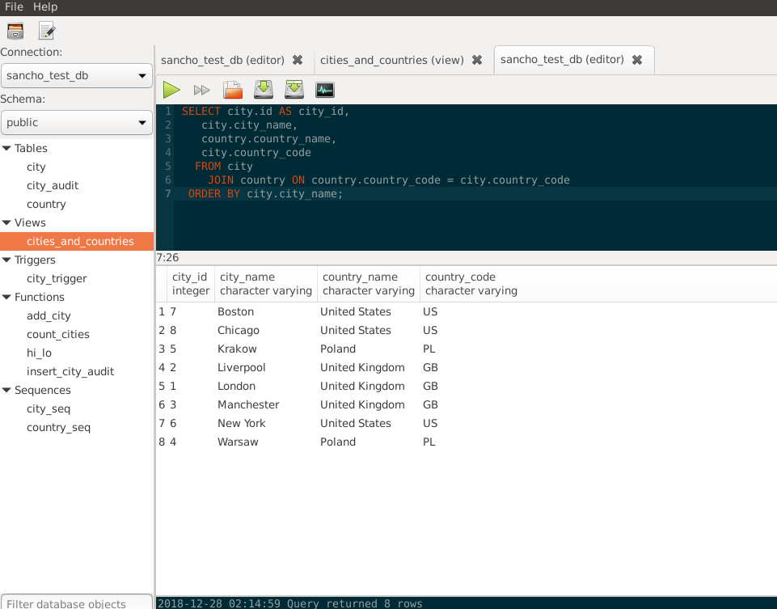

**SanchoSQL** is a desktop client application for PostgreSQL database. It allows viewing and manipulating database objects.

**See more:** {{@features}}

## Main features

- Database table editor

You can view tables in your databases using simple UI

Update, insert and delete table rows quickly without using SQL

- Easy to use SQL editor

SQL editor with syntax highlighting and tab-based user interface with the ability to work with many tables and queries at the same time

- View table information and statistics

**More features and screenshots:** {{@features}}

[Source code on github](https://github.com/lchsk) | [Twitter](https://twitter.com/sanchosql) | {{@how-to-connect-to-postgres-on-aws}} | {{@how-to-connect-to-postgres-on-heroku}}

